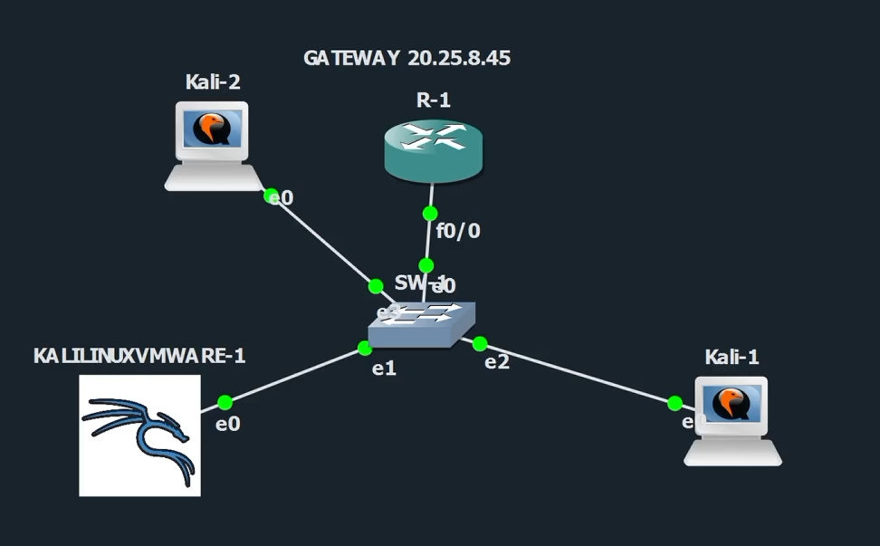
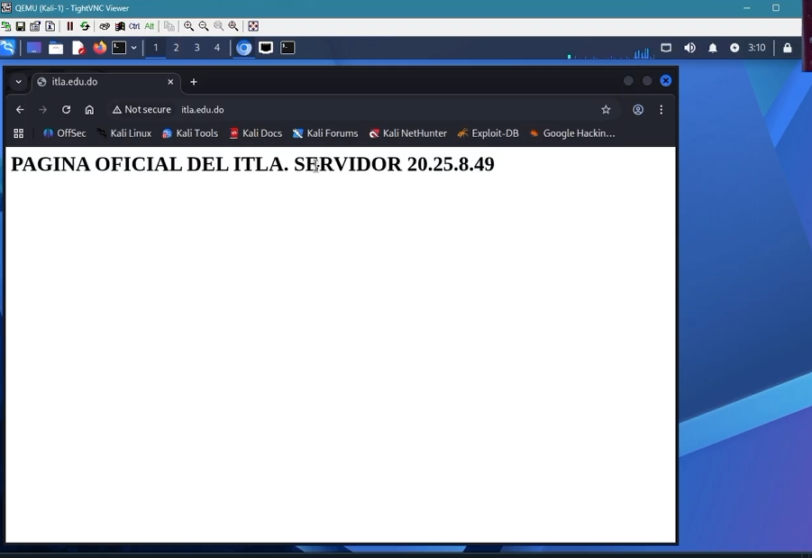
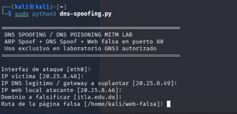
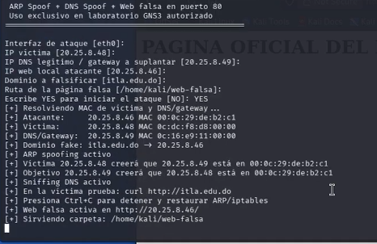
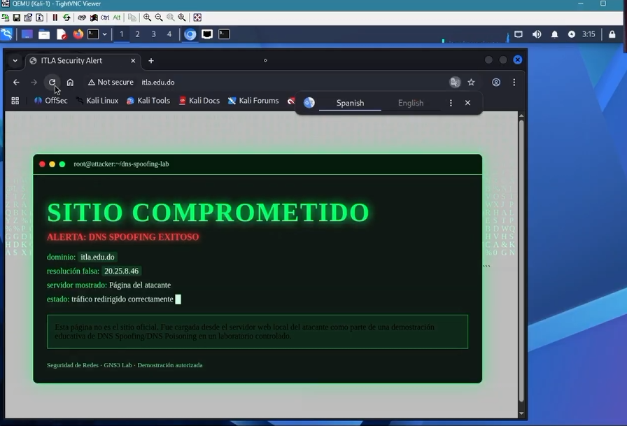
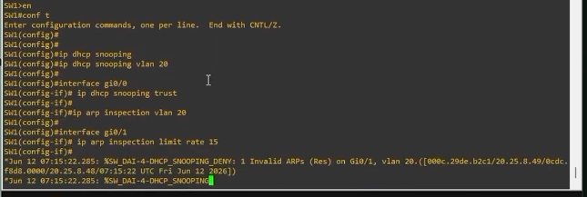
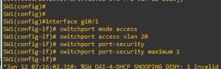

# DNS Spoofing / DNS Poisoning - How-To

Repositorio: https://github.com/iClexi/DNS-Poisoning-Spoofing  
Playlist / video: https://youtube.com/playlist?list=PLTp8NH1NHehxblNDD-ApWYQsKbfWJVFmf&si=vD3gJYk3grB9q30f

## 1. Objetivo

Este repositorio documenta un laboratorio autorizado en GNS3 donde se realiza DNS Spoofing/DNS Poisoning sobre el dominio `itla.edu.do`. El objetivo es demostrar que la víctima puede ver una página falsa alojada en la máquina atacante cuando la resolución DNS es manipulada.

## 2. Topología usada



| Equipo | Rol | IP |
|---|---|---|
| R-1 | Gateway de la red | 20.25.8.45 |
| Kali-2 | DNS legítimo y servidor web oficial | 20.25.8.49 |
| Kali-1 | PC víctima | 20.25.8.48 |
| KALILINUXVMWARE-1 | Máquina atacante | 20.25.8.46 |
| SW-1 | Switch capa 2 | N/A |

## 3. Requisitos

- GNS3 con la topología anterior.
- Kali Linux en la máquina atacante.
- Python 3.
- Scapy instalado.
- Permisos de superusuario.
- Servicio web oficial activo en `20.25.8.49`.
- Página falsa preparada en `/home/kali/web-falsa`.

Instalación de dependencia principal:

```bash
sudo apt update
sudo apt install -y python3-scapy
```

## 4. Estado normal antes del ataque

Desde la víctima se entra a `http://itla.edu.do` y se visualiza la página oficial servida por `20.25.8.49`.



## 5. Ejecutar el ataque

En la máquina atacante:

```bash
sudo python3 dns-spoofing.py
```

Parámetros usados:

```text
Interfaz de ataque: eth0
IP víctima: 20.25.8.48
IP DNS legítimo / gateway a suplantar: 20.25.8.49
IP web local atacante: 20.25.8.46
Dominio a falsificar: itla.edu.do
Ruta de la página falsa: /home/kali/web-falsa
```



Después de confirmar con `YES`, el script realiza ARP Spoofing, responde consultas DNS hacia `itla.edu.do` con la IP del atacante y levanta el servidor web falso.



## 6. Validar el resultado

En la víctima:

```bash
curl http://itla.edu.do
```

O desde el navegador abrir:

```text
http://itla.edu.do
```

Resultado esperado: la víctima ya no ve la página oficial, sino la página alojada en el atacante `20.25.8.46`.



## 7. Mitigación

La mitigación principal es proteger la capa 2 para impedir el ARP Spoofing que permite posicionar al atacante en medio. En el switch se recomienda usar DHCP Snooping, Dynamic ARP Inspection y Port Security.

Ejemplo de mitigación:

```cisco
ip dhcp snooping
ip dhcp snooping vlan 20
interface gi0/0
 ip dhcp snooping trust
ip arp inspection vlan 20
interface gi0/1
 ip arp inspection limit rate 15
```



Mitigación adicional en puertos de usuario:

```cisco
interface gi0/1
 switchport mode access
 switchport access vlan 20
 switchport port-security
 switchport port-security maximum 1
```



## 8. Detener y limpiar

Para detener el ataque correctamente:

```text
Ctrl+C
```

El script intenta restaurar ARP, eliminar reglas de iptables y apagar el servidor web falso.

## 9. Archivos del repositorio

```text
README.md
dns-spoofing.py
docs/Documentacion-Tecnica-Profesional.docx
docs/Documentacion-Tecnica-Profesional.pdf
images/
enlaces.txt
```

## 10. Autor

Michael David Robles Fermín  
Matrícula: 2025-0845  
Asignatura: Seguridad de Redes
